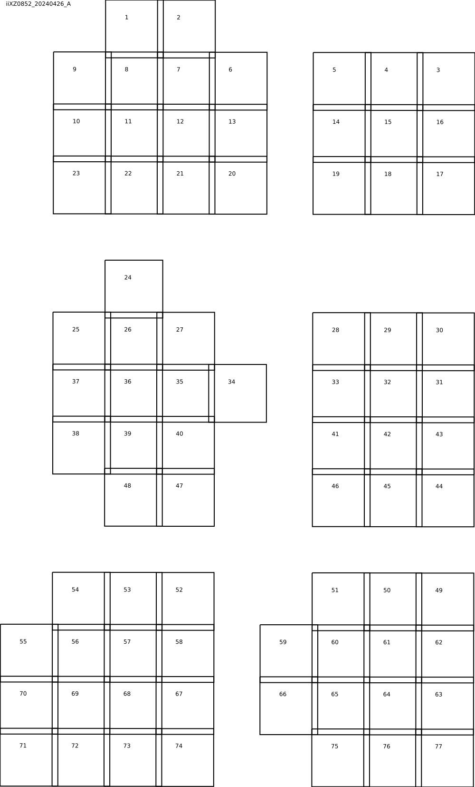

# nd2toolx

Some extra utilites/extensions to nd2tool.

- Generate a svg image with the layout, i.e. placements, of the FOV.
- Tile all or some FOV to a large tif image.
- Merge tiled images into a multicolor composite image.
- Generate a DZI image that can be used to publish large composite
  images on the web with OpenSeadragon.

## Requirements:
- Linux
- Python 3.10--3.12
- nd2tool

Optional:
- vips
- deconwolf


## Setup

- install nd2tool github.com/elgw/nd2tool/
- install vips if you will be using the png->dzi option
  ``` shell
  $ sudo apt install libvips-tools
  ```

- Install the script with pipx

``` shell
pipx install --force .
```

## Alternative -- without installing

- create a python environment
   ``` shell
   python -m venv .venv
   source .venv/bin/activate
   pip install pandas tifffile pillow scipy pycairo
   ```

- Create a start script like this and place it in you local bin
  directory -- use `echo $PATH` to see the options or add a new folder to
  the environmental variables.

   ``` shell
   #!/bin/bash
   source /path/to/nd2toolx/.venv/bin/activate
   python /path/to/nd2toolx/nd2toolx/__main__.py "$@"
   ```

## Usage

The script contains help sections for all commands, see that for detailed usage.

## Generate a layout:

``` shell
nd2toolx layout --nd2 file.nd2
# creates file/layout.svg and file/layout.svg.log.txt
```

The layout does of course depend on the image but could look like this:

<p align="center">

</p>

## Tile images

Images, or FOV, from an ND2 images can be put together (tiled) to
produce really large images. In that case the coordinates from the ND2
file is used:

<p align="center">

</p>


## TODO
 - accept a prefix like 'dw_'
