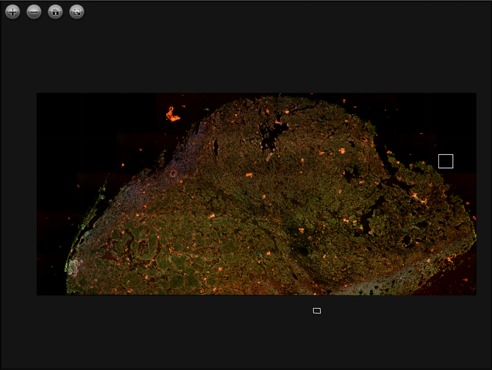

# nd2toolx

A toolbox with extra utilites/extensions to
[nd2tool](https://github.com/elgw/nd2tool/).

- Generate a svg image with the layout, i.e. placements, of the FOV,
  along with the coordinate transformation to go from images
  coordinates to microscope coordinates.

- Tile all or some FOV of an individual channel to a large tif image.

- Merge tiled images into a multicolor composite image.

- Generate a DZI image that can be used to publish large composite
  images on the web with OpenSeadragon.

The status of this tool is pretty much experimental. It is based on a
set of bash and MATLAB scripts and all functionality is not
transferred to python yet. Please let me know if you find it useful or
if what isn't working by submitting an [issue](https://github.com/elgw/nd2toolx/issues).

## Setup

### Dependencies

Required:

- Linux
- Python, tested with version 3.10, 3.11, 3.12.
- [nd2tool](https://github.com/elgw/nd2tool/) -- for conversion from nd2 to tif and for extraction of metadata.

Optional:

- [libvips](https://www.libvips.org/)
- [deconwolf](https://github.com/elgw/deconwolf) -- to deconvolve images before tiling.
- [OpenSeadragon](https://openseadragon.github.io/) -- great for interactively showing really large images.
- [pipx](https://github.com/pypa/pipx) -- for simple installation.

### Installation

- install nd2tool github.com/elgw/nd2tool/
- install vips if you will be using the png->dzi option
  ``` shell
  $ sudo apt install libvips-tools
  ```

- Install the script with [pipx](https://github.com/pypa/pipx)

``` shell
pipx install .
```

You should now be able to run the script, and the output should be
something like this:

``` shell
$ nd2toolx --version
0.1.0
```

### Alternative -- use without installing

- create a python environment
   ``` shell
   python -m venv .venv
   source .venv/bin/activate
   pip install pandas tifffile pillow scipy pycairo
   ```

- Create a start script like this and place it in you local bin
  directory -- use `echo $PATH` to see the options or add a new folder to
  the environmental variables.

   ``` shell
   #!/bin/bash
   source /path/to/nd2toolx/.venv/bin/activate
   python /path/to/nd2toolx/nd2toolx/__main__.py "$@"
   ```

## Usage

The script contains help sections for all commands, see that for detailed usage.

### Generate a layout

``` shell
$ nd2toolx layout --nd2 file.nd2
# creates file/layout.svg and file/layout.svg.log.txt
```

The layout does of course depend on the image but could look like this:

<p align="center">

</p>

### Tile images

Images, or FOV, from an ND2 images can be put together (tiled) to
produce really large images. In that case the coordinates from the ND2
file is used, see `nd2toolx tile --help` for instructions.

In general this is a two step procedure:

1. Metadata is extracted from the nd2 file to generate configuration files.

2. Edit the configuration files to specify dynamic range, colors and what FFOV to be included.

3. The FOV of interests are tiled, one tif image per channel is created.

4. The tiled images are merged to a PNG composite image.

5. If wanted, the PNG image is converted to a DZI image with vips.

Example of multiple 20X images tiled together, converted to DZI and
shown by OpenSeadragon where some annotations by
[Annotorious](https://annotorious.github.io/) can also be seen.

<p align="center">

</p>

The script will automatically estimate background variations and
subtract them before gluing the images together, given that there are
enough FOV.

### Example usage
Run once to generate the configuration files:

``` shell
$ nd2toolx tile --nd2 /data/iiXZ0162_20210416_001.nd2
Creating ./iiXZ0162_20210416_001/
nd2 file: /data//iiXZ0162_20210416_001.nd2
channel file: ./iiXZ0162_20210416_001/tile_channels.json
geometry file: ./iiXZ0162_20210416_001/tile_geometry.csv
Output size: 5662 x 23294 pixels
Please edit the generated config files and run again
```

In this case we will edit the `tile_channels.json` to make dapi blue and A647 red:

``` json
[
    {
        "name": "dapi",
        "percentile": [
            0.1,
            0.99
        ],
        "color": [
            0,
            0,
            255
        ]
    },
    {
        "name": "A647",
        "percentile": [
            0.1,
            0.99
        ],
        "color": [
            255,
            0,
            0
        ]
    }
]
```

Run again to extract the tif files from the nd2 file, and to tile the
images from each channel and to create a composite png file:

``` shell
$ nd2toolx tile --nd2 /data/iiXZ0162_20210416_001.nd2
nd2 file: /data/iiXZ0162_20210416_001.nd2
imdir: ./iiXZ0162_20210416_001/
channel file: ./iiXZ0162_20210416_001/tile_channels.json
geometry file: ./iiXZ0162_20210416_001/tile_geometry.csv
Converting nd2 to tif
8 FOV in 2 channels:
   #1 'dapi', λ_em=385.0 #8900FF  uv
   #2 'A647', λ_em=710.0 #E10000  ir
Bits per pixel: 16, significant: 16
dx=65.4 nm, dy=65.4 nm, dz=200.0 nm
NA=1.450, ni=1.515
Objective Name: Plan Apo λ 100x Oil
Objective Magnification: 100.0X
Volume size: 2048 x 2048 x 71
Looping: Dimensions: XY(8) x λ(2) x Z(71)
Camera: Andor Zyla VSC-05544
Microscope: Ti2 Microscope
iiXZ0162_20210416_001/dapi_001.tif ... writing ... done
iiXZ0162_20210416_001/A647_001.tif ... writing ... done
...
Creating max projections
Output size: 23295 x 5663
savename: ./iiXZ0162_20210416_001/bg_max_dapi.tif
Search pattern: ./iiXZ0162_20210416_001/max_dapi*.tif
Found 8
Only 8 available, background estimation disabled
Processing A647
..
Percentiles: 0.1, 0.99
Pixel values: 0.0, 65520.0
Range: 4352.0 -- 12480.0 from select_value
..
Converting to RGB
Writing to ./iiXZ0162_20210416_001//composite.png
```

## Planned

 - Use deconvolved images. In this case the user would have to
   deconvolve the files manually and let the script know that the
   image files to read should be prefixed, for example by 'dw_'.
